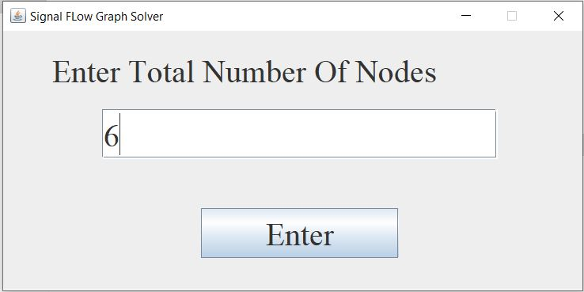
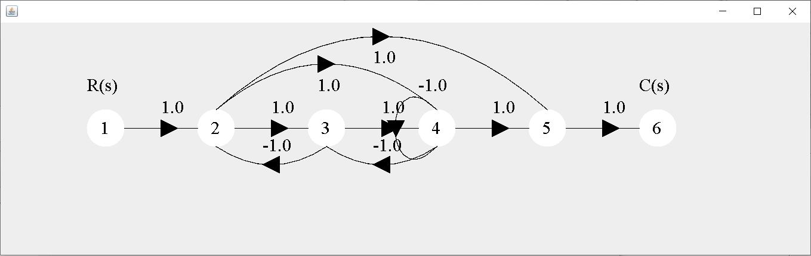
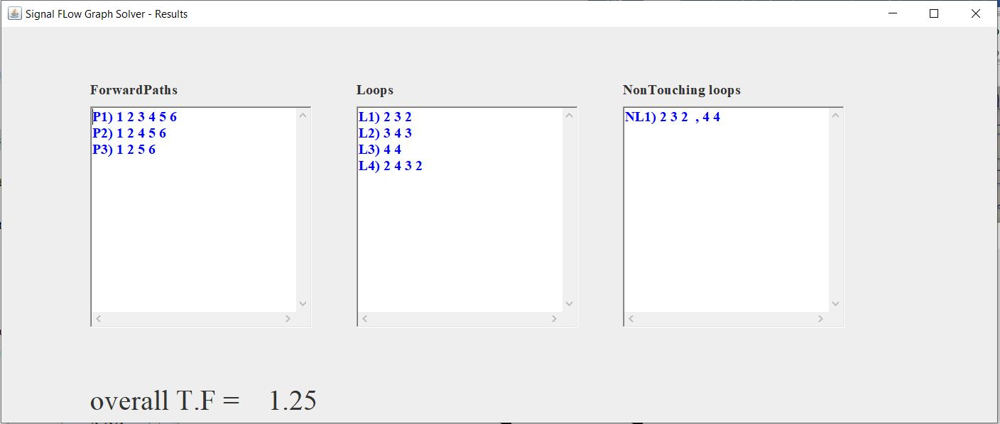

# Signal-Flow-Graph-Solver
An interactive signal flow graph solver that allows the user to create his signal flow graph using GUI for entering edges and gains and compute the overall gain.
# Getting Started
## User Guide
The program allows the user to create the graph very easily with the buttons that provide in the GUI
- The user can add a node or remove it
- Then add the branches between nodes
- The user can clear all the graph and reconstruct it
- Then user should select the source and the end nodes
- Then he can solve the graph using mason’s rule
## Sample Runs

## Build With
Java - The programming language used
## Author
Ahmed Hamdy [Ahmed Hamdy](httpsgithub.comAhmed1Radwan)
